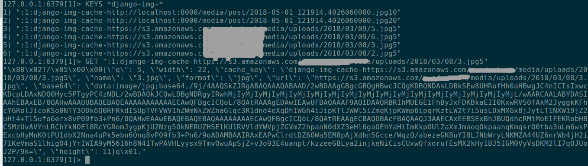

# django-img-cache
> A quick hack for faster image caching at back-end for progressive image loading on django website.

## Features
* supports image resizing for all formats 
* faster image caching at backend on redis/memcached db
* saving your CDN cost ;)
* Tested on django >=1.10

## Installation
```shell
pip install django-img-cache
```

## Usage
### Project Setting
* After installation, register the app in INSTALLED_APPS section of your project settings.
```
INSTALLED_APPS = (
    'blog',
    'news',
    'all_auth',

    'img_cache',
)
```
### Default Settings for app
* These are default `settings`, you can overwrite them in Project `settings` as per requirement.
```
IMGCACHE_DEFAULT_STYLE='width:100%' # used in imgcache and imgcache_src
IMGCACHE_DEFAULT_CLASS='img-responsive'
IMGCACHE_DEFAULT_Q='10' # default resizing percent
IMGCACHE_TMP_DIR='img-cache' # full path will be /tmp/img-cache
IMGCACHE_KEY_PREFIX='django-img-cache' # cache key prefix
IMGCACHE_DEFAULT_CONTENT_CLASS='img-blur' # used in imgcache_content
IMGCACHE_DEFAULT_CONTENT_STYLE='width:100%' # used in imgcache_content
```
* Resizing Percent `Q or q` Explaination:
```
intial image of width(W) and height(H) after resizing to Q percent say 20
final image will be of 0.2W and 0.2H, keeping aspect ratio same.
```
* You can also pass required width and height in pixels instead of resizing percentage. 
### Template Usage
* first load the template tag:
```

```
* there are `imgcache` tag and two filter tag `imgcache_src` and `imgcache_content`
```html
<html>

<body>
    <!---
        safe tag for rendering html of img,
        q=10 -> resize to 10% img width and height
    !-->
    
        {{img | safe}}  
    
    <h2>Description</h2>
    
    <p>This is blog contents....</p>
    <!--
    1. blog.content is full of html markup containing images and divs, so imgcache_content tag will replace existing img tags with img tags containing cached_img src and that is there is also safe filter after that to render html in browser.
    2.you can class and style for imgcache_content in settings e.g: IMGCACHE_DEFAULT_CONTENT_CLASS='your-desired-class-of-css'
    !-->
    {{blog.content | imgcache_content | safe}}

    <!--
     imgcache_src:'3'; here 3 is q(resizing percent)
    !-->
    
</body>
<script type="text/javascript">
// show cached images of low quality with blur effect and do lazy loading of HQ img
// and replace them on loading.
// similar to medium.com, the blur effect on low quality image initialy and then full high quality image
window.onload = function() {
  var images = document.querySelectorAll('.img-blur');
  images.forEach(function(img){
      var largeImage = new Image();
      largeImage.src = img.dataset.src;
      largeImage.onload = function(){
        img.src = largeImage.src;
        img.classList.remove('img-blur');
      }
  })
}
</script>
</html>
```
* There will be initially slow loading of page because it will take sometime to download and cache all those images, on successive loading it will be blazing fast.

* Screenshot of Redis-DB afer page loading:




